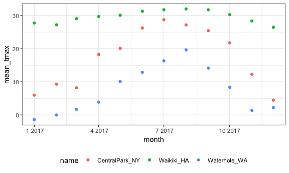
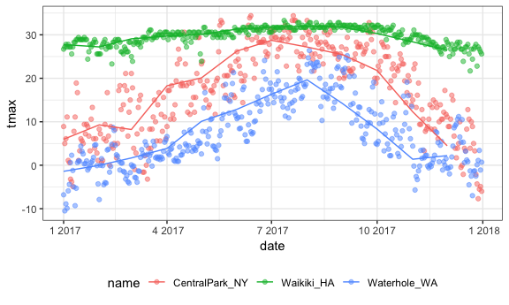

group\_by
================
Guojing Wu

-   [start grouping](#start-grouping)

data import

``` r
weather_df = 
  rnoaa::meteo_pull_monitors(c("USW00094728", "USC00519397", "USS0023B17S"),
                      var = c("PRCP", "TMIN", "TMAX"), 
                      date_min = "2017-01-01",
                      date_max = "2017-12-31") %>%
  mutate(
    name = recode(id, USW00094728 = "CentralPark_NY", 
                      USC00519397 = "Waikiki_HA",
                      USS0023B17S = "Waterhole_WA"),
    tmin = tmin / 10,
    tmax = tmax / 10,
    month = lubridate::floor_date(date, unit = "month")) %>%
  select(name, id, date, month, everything())
```

start grouping
--------------

``` r
weather_df %>% 
  group_by(name, month) %>% 
  ungroup()
```

    ## # A tibble: 1,095 x 7
    ##    name           id          date       month       prcp  tmax  tmin
    ##    <chr>          <chr>       <date>     <date>     <dbl> <dbl> <dbl>
    ##  1 CentralPark_NY USW00094728 2017-01-01 2017-01-01     0   8.9   4.4
    ##  2 CentralPark_NY USW00094728 2017-01-02 2017-01-01    53   5     2.8
    ##  3 CentralPark_NY USW00094728 2017-01-03 2017-01-01   147   6.1   3.9
    ##  4 CentralPark_NY USW00094728 2017-01-04 2017-01-01     0  11.1   1.1
    ##  5 CentralPark_NY USW00094728 2017-01-05 2017-01-01     0   1.1  -2.7
    ##  6 CentralPark_NY USW00094728 2017-01-06 2017-01-01    13   0.6  -3.8
    ##  7 CentralPark_NY USW00094728 2017-01-07 2017-01-01    81  -3.2  -6.6
    ##  8 CentralPark_NY USW00094728 2017-01-08 2017-01-01     0  -3.8  -8.8
    ##  9 CentralPark_NY USW00094728 2017-01-09 2017-01-01     0  -4.9  -9.9
    ## 10 CentralPark_NY USW00094728 2017-01-10 2017-01-01     0   7.8  -6  
    ## # ... with 1,085 more rows

doing some summarize

``` r
weather_df %>% 
  group_by(name, month) %>% 
  summarize(number = n())
```

    ## # A tibble: 36 x 3
    ## # Groups:   name [?]
    ##    name           month      number
    ##    <chr>          <date>      <int>
    ##  1 CentralPark_NY 2017-01-01     31
    ##  2 CentralPark_NY 2017-02-01     28
    ##  3 CentralPark_NY 2017-03-01     31
    ##  4 CentralPark_NY 2017-04-01     30
    ##  5 CentralPark_NY 2017-05-01     31
    ##  6 CentralPark_NY 2017-06-01     30
    ##  7 CentralPark_NY 2017-07-01     31
    ##  8 CentralPark_NY 2017-08-01     31
    ##  9 CentralPark_NY 2017-09-01     30
    ## 10 CentralPark_NY 2017-10-01     31
    ## # ... with 26 more rows

``` r
weather_df %>% 
  count(name, month)
```

    ## # A tibble: 36 x 3
    ##    name           month          n
    ##    <chr>          <date>     <int>
    ##  1 CentralPark_NY 2017-01-01    31
    ##  2 CentralPark_NY 2017-02-01    28
    ##  3 CentralPark_NY 2017-03-01    31
    ##  4 CentralPark_NY 2017-04-01    30
    ##  5 CentralPark_NY 2017-05-01    31
    ##  6 CentralPark_NY 2017-06-01    30
    ##  7 CentralPark_NY 2017-07-01    31
    ##  8 CentralPark_NY 2017-08-01    31
    ##  9 CentralPark_NY 2017-09-01    30
    ## 10 CentralPark_NY 2017-10-01    31
    ## # ... with 26 more rows

Compute multiple summaries within each group, the difference between summarize and mutate is that when you do group\_by, summarize is gonna collapse all the observations, but mutate is gonna show all the observations and simply add another column.

``` r
weather_df %>%
  group_by(name, month) %>%
  summarize(number = n(),
            num_na = sum(is.na(tmax)), # count missing data
            mean_tmax = mean(tmax, na.rm = T), 
            sd_tmin = sd(tmin, na.rm = T))
```

    ## # A tibble: 36 x 6
    ## # Groups:   name [?]
    ##    name           month      number num_na mean_tmax sd_tmin
    ##    <chr>          <date>      <int>  <int>     <dbl>   <dbl>
    ##  1 CentralPark_NY 2017-01-01     31      0      5.98    4.47
    ##  2 CentralPark_NY 2017-02-01     28      0      9.28    5.05
    ##  3 CentralPark_NY 2017-03-01     31      0      8.22    5.78
    ##  4 CentralPark_NY 2017-04-01     30      0     18.3     3.82
    ##  5 CentralPark_NY 2017-05-01     31      0     20.1     3.75
    ##  6 CentralPark_NY 2017-06-01     30      0     26.3     4.23
    ##  7 CentralPark_NY 2017-07-01     31      0     28.7     2.32
    ##  8 CentralPark_NY 2017-08-01     31      0     27.2     2.06
    ##  9 CentralPark_NY 2017-09-01     30      0     25.4     3.42
    ## 10 CentralPark_NY 2017-10-01     31      0     21.8     4.42
    ## # ... with 26 more rows

``` r
weather_df %>%
  group_by(name, month) %>%
  mutate(mean = mean(tmax, na.rm = T))
```

    ## # A tibble: 1,095 x 8
    ## # Groups:   name, month [36]
    ##    name           id          date       month       prcp  tmax  tmin  mean
    ##    <chr>          <chr>       <date>     <date>     <dbl> <dbl> <dbl> <dbl>
    ##  1 CentralPark_NY USW00094728 2017-01-01 2017-01-01     0   8.9   4.4  5.98
    ##  2 CentralPark_NY USW00094728 2017-01-02 2017-01-01    53   5     2.8  5.98
    ##  3 CentralPark_NY USW00094728 2017-01-03 2017-01-01   147   6.1   3.9  5.98
    ##  4 CentralPark_NY USW00094728 2017-01-04 2017-01-01     0  11.1   1.1  5.98
    ##  5 CentralPark_NY USW00094728 2017-01-05 2017-01-01     0   1.1  -2.7  5.98
    ##  6 CentralPark_NY USW00094728 2017-01-06 2017-01-01    13   0.6  -3.8  5.98
    ##  7 CentralPark_NY USW00094728 2017-01-07 2017-01-01    81  -3.2  -6.6  5.98
    ##  8 CentralPark_NY USW00094728 2017-01-08 2017-01-01     0  -3.8  -8.8  5.98
    ##  9 CentralPark_NY USW00094728 2017-01-09 2017-01-01     0  -4.9  -9.9  5.98
    ## 10 CentralPark_NY USW00094728 2017-01-10 2017-01-01     0   7.8  -6    5.98
    ## # ... with 1,085 more rows

normal ggplot

``` r
weather_df %>%
  group_by(name, month) %>%
  summarize(number = n(),
            num_na = sum(is.na(tmax)), # count missing data
            mean_tmax = mean(tmax, na.rm = T), 
            sd_tmin = sd(tmin, na.rm = T)) %>% 
  ggplot(aes(x = month, y = mean_tmax, color = name)) +
  geom_point()
```



ggplot using different dataset

``` r
month_df = 
  weather_df %>%
  group_by(name, month) %>%
  summarize(number = n(),
            num_na = sum(is.na(tmax)), # count missing data
            mean_tmax = mean(tmax, na.rm = T), 
            sd_tmin = sd(tmin, na.rm = T))

ggplot(weather_df, aes(x = date, y = tmax, color = name)) +
  geom_point(alpha = 0.5) +
  geom_line(data = month_df, aes(x = month, y = mean_tmax, color = name))
```

    ## Warning: Removed 3 rows containing missing values (geom_point).



Sometimes tidy date is not helpful

``` r
weather_df %>% 
  group_by(name, month) %>% 
  summarise(mean_tmax = mean(tmax, na.rm = T)) %>% 
  spread(key = name, value = mean_tmax)
```

    ## # A tibble: 12 x 4
    ##    month      CentralPark_NY Waikiki_HA Waterhole_WA
    ##    <date>              <dbl>      <dbl>        <dbl>
    ##  1 2017-01-01           5.98       27.8      -1.4   
    ##  2 2017-02-01           9.28       27.2      -0.0179
    ##  3 2017-03-01           8.22       29.1       1.67  
    ##  4 2017-04-01          18.3        29.7       3.87  
    ##  5 2017-05-01          20.1        30.1      10.1   
    ##  6 2017-06-01          26.3        31.3      12.9   
    ##  7 2017-07-01          28.7        31.8      16.3   
    ##  8 2017-08-01          27.2        32.0      19.6   
    ##  9 2017-09-01          25.4        31.7      14.2   
    ## 10 2017-10-01          21.8        30.3       8.31  
    ## 11 2017-11-01          12.3        28.4       1.38  
    ## 12 2017-12-01           4.47       26.5       2.21
